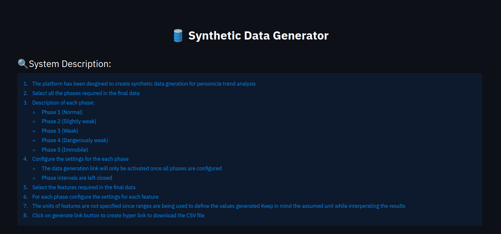
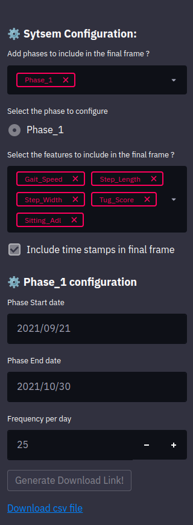
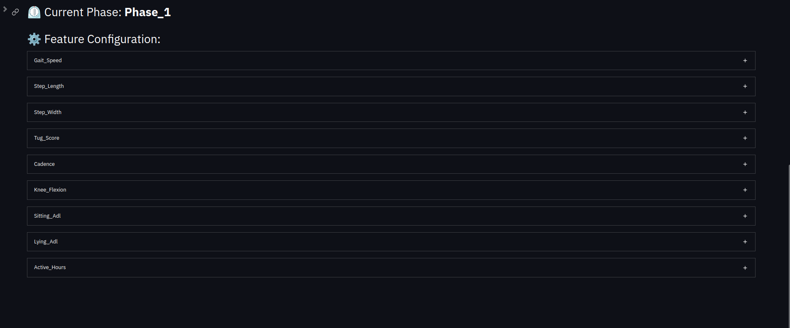

<h1>Synthetic Data Generator for Movement and Gait features </h1>

This web application is designed to create synthetic data for training AI models to quantify quality of gait and
    movement.
    These downstream AI models depend on feature assoicated with movement and gaits.
    This web application enables us to create synthetic data for these required features

    Currently the data is generated for the following features:
    <li>
        'Gait_Speed': the time one takes to walk a specified distance on level surfaces over 2 meters
    </li>
    <li>
        'Step_Length': the distance between the point of initial contact of one foot and the point of initial contact of
        the opposite foot
    </li>
    <li>
        'Step_Width': the distance between the heels of the two feet during double stance
    </li>
    <li>
        'Tug_Score': the score on the `time for up and go` test
    </li>
    <li>
        'Cadence': walking rate calculated in steps per minute
    </li>
    <li>
        'Knee_Flexion': the angle between the femoral median axis (FMA) and the tibial median axis (TMA) (a)
    </li>
    <li>
        'Sitting_Adl': Number of minutes spent in a day doing activities of daily living sitting
    </li>
    <li>
        'Lying_Adl': Number of minutes spent in a day doing activities of daily living lying
    </li>
    <li>
        'Active_Hours': NUmber of minutes spent doing standing chores through out the day
    </li>

    The web application allows users to select and emulate data of five different phases of movement (Normal, Slightly
    Weak, Weak, Dangerously Weak, and Immobile) for a single dataset.
    
    With this application, you can train AI models that can quantify the quality of
    movement with ease and accuracy.

<h2>Features</h2>
<ul>
    <li>Selectfrom five different phases: Normal, Slightly Weak, Weak, Dangerously Weak, and Immobile</li>
    <li>Configure settings for each phase</li>
    <li>Select the features required in the final data</li>
    <li>Configure settings for each feature</li>
    <li>Generate a CSV file containing the synthetic data</li>
</ul>
<h2>Screenshots</h2>

    
    

<h2>How to use</h2>
<ol>
    <li>Select the phases and features you want to include in the final data.</li>
    <li>Configure the settings for each phase and feature.</li>
    <li>Click on the "Generate Link" button to create a hyperlink to download the CSV file.</li>
    <li>Please note that the data generation link will only be activated once all phases are configured.</li>
    <li>The units of features are not specified since ranges are being used to define the values generated, please
        keep in mind the assumed unit while interpreting the results.</li>
</ol>
<h2>Technical details</h2>
<ul>
    <li>Built using Streamlit, pandas, numpy, and scipy</li>
    <li>Works on Windows, Mac, and Linux</li>
</ul>
<h2>Future plans</h2>
<ul>
    <li>Additional options to download the data in other formats</li>
    <li>Additional visualization options for the generated data</li>
</ul>
<h2>Contributing</h2>

If you would like to contribute to this project, please follow these guidelines:

<ol>
    <li>Fork the repository</li>
    <li>Create a new branch for your changes</li>
    <li>Submit a pull request</li>
</ol>
<h2>Live Demo</h2>

The live version of the application can be found <a href="https://synthetic-data-generation.herokuapp.com/"
        target="_new">here</a>

<h2>How to run the application on local machine</h2>
<ol>
    <li>Clone this repository</li>
    <li>Install the required dependencies using <code>pip install -r requirements.txt</code></li>
    <li>Run the application using <code>streamlit run app.py</code></li>
    <li>The application will be running on <code>http://localhost:8501/</code></li>
</ol>